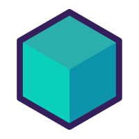

:revealjs_customtheme: assets/testcontainers_breizhcamp.css
:revealjs_progress: true
:revealjs_slideNumber: true
:source-highlighter: highlightjs
:icons: font
:toc:

= Testcontainers
 
== Testcontainers

[.splashscreen-title]
****
Tu ne douteras plus de tes fonctionnalités,

jeune Pydawan·e
****

[.medium-text]
*Luc Sorel-Giffo* -- jeudi 27 juin 2024 - 10h30 amphi A -- BreizhCamp (Rennes)

[.columns]
=== Qui suis-je ?

[.column]
--
* tech lead Python chez Purecontrol `#techForGood`

* (OSS) outils doc-as-code :
** https://github.com/lucsorel/py2puml[py2puml]
** https://github.com/lucsorel/pydoctrace[pydoctrace]
--

[.column]
--
* co-animateur Python Rennes

.Meetup : https://www.meetup.com/fr-FR/python-rennes/[www.meetup.com/fr-FR/python-rennes]
image::assets/python_rennes-communauté.png[communauté Python Rennes, 40%]

.Pour rejoindre le slack : https://join.slack.com/t/pythonrennes/shared_invite/zt-1yd4yioap-lBAngm3Q0jxAKLP6fYJR8w[join.slack.com/t/pythonrennes/shared_invite/zt-1yd4yioap-lBAngm3Q0jxAKLP6fYJR8w]
image::assets/qr_code-slack-Python_Rennes.svg[Rejoindre le slack Python Rennes, 35%]

* https://floss.social/@lucsorelgiffo[@lucsorelgiffo@floss.social]
--

=== Préambule

image::assets/attention-diapos-techniques.png[Diapos techniques, 70%]

[.medium-text]
* ⚠️ diapos techniques
** testcontainers
** pytest : fixtures, markers
** Python : gestionnaire de contexte, générateur (yield), architecture
* démos : https://github.com/lucsorel/members-agenda[members-agenda] (planning de bénévoles gérant les indisponibilités)

[.notes]
--
https://youtu.be/6TfHqrWejdo?feature=shared&t=46[Star Wars: Return of the Jedi - Rebel Briefing]
--

[.columns]
=== members-agenda

[.column]
--
[plantuml, target=class-diagram, format=svg]
----
@startuml
skinparam linetype polyline
class Slot {
  title: str
  start: datetime
  end: datetime
  venue: Venue
  members: list[Person]
}
class Venue {
  name: str
}
class Event {
  title: str
  start: datetime
  end: datetime
  venue: Venue
  speakers: list[Person]
}
class Person {
  name: str
  is_member: bool
}

Slot "*" -up-> "1" Venue : "happens in"
Event "*" -up-> "1" Venue : "happens in"
Slot "*" <-down- "*" Person : "helps in"
Event "*" <-down- "*" Person : "speaks in"

note right of Person
  une personne ne peut pas **intervenir**
  et **être bénévole** en même temps
end note

@enduml
----
--

[.column]
--
Environnement technique :

* server web : https://fastapi.tiangolo.com/[FastAPI]
* base de données : MySQL (avec https://pymysql.readthedocs.io/en/latest/index.html[pymysql])
* framework de test : https://docs.pytest.org/en/stable/[pytest]
--

== Pourquoi tester ?

🤷 ?

[.notes]
--
* qui travaille sur des projets dans lesquels il y a des tests automatisés ?
* qui travaille dans une entreprise dans laquelle il y a un budget d'astreinte ?
--

=== Pourquoi tester ?

[plantuml, target=mindmap-diagram, format=svg]
----
@startmindmap
+[#lightblue] **tester**
++[#lightyellow] pourquoi ?
+++ valider
++++ fonctionnel (cas droits)
++++ robustesse (cas d'erreur)
+++ documenter les IO
++++ entrées / sorties de fonctions
++++ artefacts lus ou écrits (fichiers, bdd, etc.)
@endmindmap
----

=== Quels types de test ?

🤷 ?

=== Quels types de test ?

[plantuml, target=mindmap-diagram, format=svg]
----
@startmindmap
+[#lightblue] **tester**
-- pourquoi ?
--- ... valider
--- ... documenter
++[#lightyellow] comment ?
+++ tests unitaires
++++ faciles
++++ rapides
++++ intérêt métier 😐
+++ tests de composants
+++ tests fonctionnels
++++ difficiles
++++ lents
++++ intérêt métier 🤓
+++ (tests de charge)
@endmindmap
----

[.notes]
--
https://www.bitecode.dev/p/testing-with-python-part-5-the-different
--

[.columns]
== Testcontainers

[.column.is-one-fifth]
--

[.medium-text]
* multi-clients : python, java, go, etc.
* +50 services (bdd, brokers)

--

[.column]
--
_A framework for providing throwaway, lightweight instances of databases, message brokers, web browsers, or just about anything that can run in a Docker container._

* https://github.com/testcontainers/testcontainers-python[github.com/testcontainers/testcontainers-python]
* 1.4k ⭐, 27 releases (juin 2024)
* open-source (Apache 2.0)
* 112 contributeur·ices
--

=== Principe de fonctionnement

* démarrage du container (+ / - configuré)
* API pour interagir avec (URL de connexion, identifiants)
* interactions avec le container (tests)
* arrêt et suppression du container

* architecture d'une base de code
** code de prod
** code de test
** conftest
** fixture

Câblage :
** par variable d'environnements (peu intrusif ; /!\ si elles sont renommées)
** monkeypatching (intrusion localisée - avec les bons outils)

markers pytest
* pouvoir labelliser des cas de tests (exclusion ou sélection)
* désélection conditionnel skipif

== Conclusions

* motivations & approches de test
* lancer un service conteneurisé dédié aux tests
* utiliser testcontainers au sein d'une session de tests pytest
* générer de la documentation fonctionnalité-architecture

[.columns]
== Merci 🙏

[.column]
--
[.splashscreen-title]
Des questions ?

[.small-text]
Présentation à retrouver sur https://github.com/lucsorel/conferences/tree/main/breizhcamp-2024.06.27-testcontainers-pytest[github.com/lucsorel/conferences/{...}/breizhcamp-2024.06.27-testcontainers-pytest] 📑
--

[.column.is-one-third]
--

.Vos retours sur https://openfeedback.io/LyIREj0UbxmZ6vcFmxmN/2024-06-27/670894[openfeedback.io/LyIREj0UbxmZ6vcFmxmN/2024-06-27/670894]
image::assets/openfeedback-testcontainers.svg[Vos retours sur openfeedback, 75%]
--

