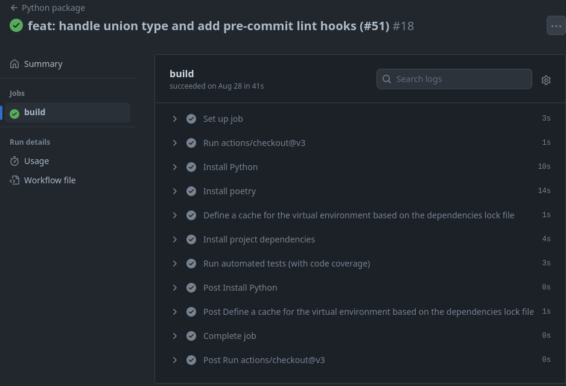
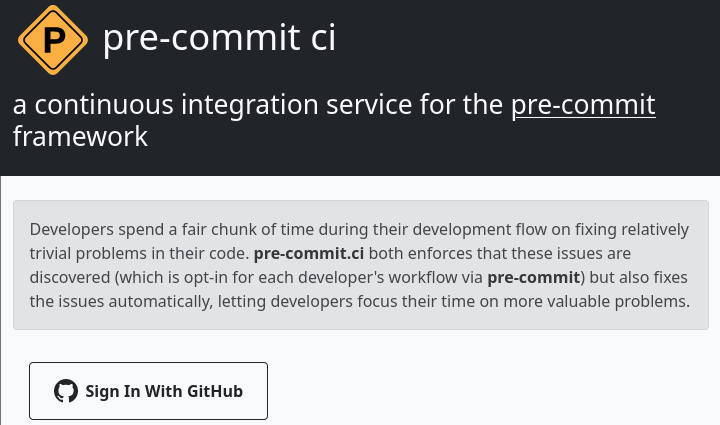
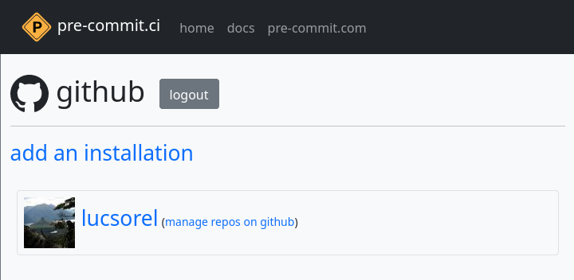
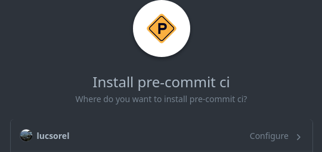
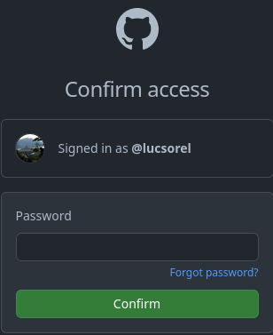
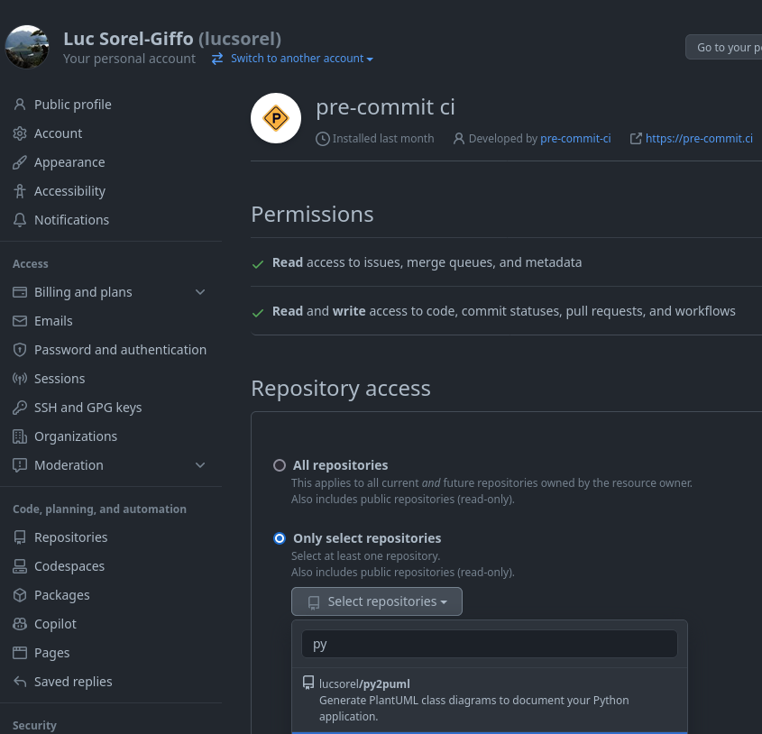
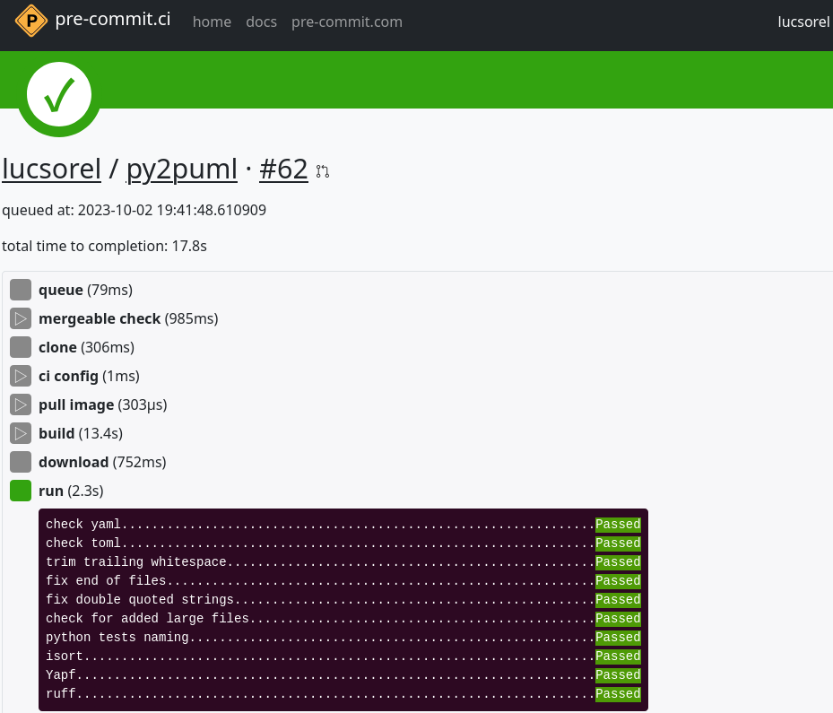

:revealjs_customtheme: assets/beige-stylesheet.css
:revealjs_progress: true
:revealjs_slideNumber: true
:source-highlighter: highlightjs
:icons: font
:toc:

= Outiller son projet open-source Python avec les Github actions

== Qui suis-je ?

* 💙💛 dev Python @ https://www.purecontrol.com[Purecontrol]
* 🐈‍⬛ https://github.com/lucsorel[github.com/lucsorel] (outils code-to-doc)
* 🐘 https://floss.social/@lucsorelgiffo[@lucsorelgiffo@floss.social]

== Le projet open-source Python

https://github.com/lucsorel/py2puml : génère un diagramme de classes en scannant les structures de données de la base de code.

image::http://www.plantuml.com/plantuml/svg/ZL9HQzim47xNhxYz5kh07aqVMaBO36jIiknfb72sBvcO97lIUH3Q_lUT7TMCEaH-qeTqztsVxhxxmEYvimRQq-TMpgnkB6gdFhKUZnQX2rGu9c-friZqXDLlF5A00vf0gZ8OmeVMh3tNPB4MNXI0Gqiv1FQ2gr_Qr9vS3jzqu9-nx5bUD9CDUzVPadmEsh5wkomXSBZFVbZpmEnrsV5KY4_jY0CZwog7icdC7DPb3mP6VESFqV3_ceFhiCTILB3Y97__mvw-a7FYz_373V1AFybmiaVg1pHf_ukcera4Oc0bvy1W1xBtlvsfduMWBxpGxyaWwyPbMp8xcU_0iTmyFcs-5xjYiyxX1bxEmtwJbsBzTRKjTW_hvIg7kzVnQUfmgY0kjn4FAg7fV4NxSKe0ZFv8FDwCAu_UH2GHpPlRsqHwLIeZaICTJvL8mzsh4ANKL6AZOkPwQkQwk2AYvkqiUaa5I1sQXid35tBaaQc6yWIBHMnSBDGzkLhGFm00[py2puml,width="45%"]

[.columns]
=== Syndrôme de Spiderman

[.column]
--
**Spiderman**

* 1 piqûre : 😬
* grimpe aux murs : 💪
* anime des soirées mousse avec les poignets : 🥳

--

[.column]
--
--

[.columns]
=== Syndrôme de Spiderman

[.column]
--
**Spiderman**

* 1 piqûre : 😬
* grimpe aux murs : 💪
* anime des soirées mousse avec les poignets : 🥳

--

[.column]
--
**py2puml**

* 140+ ⭐ : 🥳
* 37 issues (24 fermées) : 😬
* 25 PR (21 fermées) : 🥵

[.medium-text]
____
> **"De nouvelles responsabilités demandent de nouveaux pouvoirs."**
>
> Luc (du 35) 🕸️
____
--

=== Accueillir et cadrer les contributions

[%step]
* non-régression des fonctionnalités
* homogénéité des pratiques
** formatage de code
** qualité de code

=== 💡 CONTRIBUTING.md dans le dépôt ?

🗣️ "bla bla bla" -> ❌

Des conventions non outillées finissent dans l'oubli.

=== 💡 Intégration continue

* non-régression -> **tests automatisés** (+ couverture de code testé)
* homogénéité de la base de code
** formatage de code -> **formateur**
** qualité de code -> **linter**

== Mise en place des Github actions

Syntaxe **déclarative** permettant d'exécuter des commandes ou des outils au fil du cycle de vie _git_ du projet.

[source,text]
----
super-projet/
  ├─ .github/
  │  └─ workflows/
  │     ├─ {nom_de_workflow}.yml  # ci.yml, par exemple
  │     └─ ...
----

=== Anatomie progressive d'un workflow d'intégration continue Github

Départ : système d'exploitation + checkout du code source

[source,yaml]
----
name: Python CI # facultatif

on: push        # évènement(s) git déclencheur(s)

jobs:
  build:                   # le nom de l'opération
    runs-on: ubuntu-latest     # système d'exploitation utilisé
    steps:                     # étapes de l'opération
      - name: Récupération du code # facultatif
        uses: actions/checkout@v4  # utilisation d'une recette existante (⚠️ @version)
----

[.medium-text]
--
Documentation officielle des https://docs.github.com/en/actions/learn-github-actions/understanding-github-actions[Github actions].
--

=== Actions : les recettes de base

[%step]
* action = brique réutilisable et adaptable à votre besoin
** chacune a son dépôt
** configuration décrite dans `action.yaml`
** parfois accompagnée de scripts référencés dans `action.yaml`
* 62 actions "officielles" proposées par Github (septembre 2023)
* nombreuses actions communautaires

[.medium-text]
Exemples : https://github.com/actions/checkout[github.com/actions/checkout], https://github.com/abatilo/actions-poetry[github.com/abatilo/actions-poetry]

=== Étapes de build du projet

[%step]
. récupérer les sources du projet ✅
. installer `python`
. installer `poetry`
. installer les dépendances
. lancer les tests automatisés + couverture
. auditer la qualité du code

== Installation de Python - pyenv

Projet utilisant https://github.com/pyenv/pyenv/[pyenv] pour définir la version de `python`.

[source,yaml]
----
name: Python CI
on: push

jobs:
  build:
    runs-on: ubuntu-latest
    steps:
      - uses: actions/checkout@v4

      - name: Installation de Python
        uses: actions/setup-python@v4            # action officielle
        with:                                    # configuration pour pyenv
          python-version-file: '.python-version' # màj transparente de l'IC 👍
----

=== Installation de Python - alternatives

Configuration alternatives de l'action :

[source,yaml]
----
steps:
  # dernière version disponible (⚠️ varie en fonction du runner)
  - uses: actions/setup-python@v4

  # version spécifiée en dur 🤷
  - uses: actions/setup-python@v4
    with:
      python-version: '3.9'

  # utilisation de PyPy
  - uses: actions/setup-python@v4 
    with:
      python-version: 'pypy3.9' 
----

[.medium-text]
Voir d'https://github.com/actions/setup-python/blob/main/docs/advanced-usage.md[autres cas d'usage avancés] (intervalle ou matrice de versions, caches pour outils spécifiques, etc.).

=== Installation des dépendances - poetry

- utilisation de https://python-poetry.org/docs/[poetry] pour la gestion des dépendances
- dossier `.venv/` local (à mettre en cache 💡)

[source,yaml]
----
jobs:
  build:
    runs-on: ubuntu-latest
    steps:
      # [...]
      - name: Installation de poetry
        uses: abatilo/actions-poetry@v2 # action communautaire 🔍
        with:
          poetry-version: 1.5.1         # optionnel

      - name: Mise en cache de l'environnement virtuel
        uses: actions/cache@v3          # action officielle
        with:
          path: ./.venv
          key: venv-${{ hashFiles('poetry.lock') }} # clé d'éviction sur le lock-file

      - name: Installation des dépendances du projet
        run: poetry install             # exécution explicite d'une commande 🔍
----

=== Installation des dépendances - requirements.txt

Alternative avec `pip` + `requirements.txt` directement 🙅 :

[source,yaml]
----
steps:
  - uses: actions/setup-python@v4
    with:
      python-version: '3.9'
      cache: 'pip' # utilisation d'un cache pour pip

    - run: pip install -r requirements.txt # pas besoin d'environnement virtuel
                                           # au sein d'un runner
----

=== Exécution des tests

[source,yaml]
----
env:
  MIN_CODE_COVERAGE_PERCENT: 93 # 👉 définition d'une variable

jobs:
  build:
    runs-on: ubuntu-latest
    steps:
      # [...]
      - name: Lancement des tests automatisés (avec couverture de code)
        run: > # '>' permet de séparer une commande sur plusieurs lignes
          poetry run pytest -v --cov=py2puml --cov-branch
          --cov-report term-missing
          --cov-fail-under $MIN_CODE_COVERAGE_PERCENT # utilisation 👈
          # l'opération sera en échec si le taux de couverture descend sous le seuil
----

=== Consultation des exécutions de workflow dans Github

. cliquer sur le menu `Actions` de votre dépôt sur Github
. cliquer sur une des exécutions de workflow

=== Démo !

== Et les hooks de pre-commit ?

L'outil https://pre-commit.com/[pre-commit] utilise les mécanismes de hook de `git` pour lancer des outils à différentes étapes du cycle de vie `git` du projet.

.Rediffusion : https://www.youtube.com/watch?v=l0HrTE45RVM

== Exemple de configuration pre-commit (📄 .pre-commit-config.yaml)

[source,yaml]
----
repos:
-   repo: https://github.com/pre-commit/pre-commit-hooks
    rev: v4.5.0
    hooks:
    -   id: trailing-whitespace
    -   id: end-of-file-fixer
    -   id: double-quote-string-fixer

-   repo: https://github.com/google/yapf
    rev: v0.40.2
    hooks:
    -   id: yapf
        additional_dependencies: [toml]

-   repo: https://github.com/astral-sh/ruff-pre-commit
    rev: v0.0.292
    hooks:
    -   id: ruff
----

[.medium-text]
Voir https://pre-commit.com/hooks.html[pre-commit.com/hooks.html].

=== Utiliser pre-commit en intégration continue

__À la dure__ dans le runner Github d'intégration continue

** installer git 
** lancer pre-commit

Ou via une intégration avec le service https://pre-commit.ci/[pre-commit.ci]

=== Intégrer pre-commit.ci dans son projet Github 1/5

. aller sur https://pre-commit.ci/
. s'identifier avec Github

=== Intégrer pre-commit.ci dans son projet Github 2/5

- ajouter une installation

[.columns]
=== Intégrer pre-commit.ci dans son projet Github 3/5

[.column]
--
- configurer l'intégration

--

[.column]
--
- confirmer l'accès au compte

--
=== Intégrer pre-commit.ci dans son projet Github 4/5

- sélectionner le dépôt de code à intégrer

=== Intégrer pre-commit.ci dans son projet Github 5/5

☝️ Ne se déclenche que dans le cadre d'une pull-request.

== Prochaines étapes

[plantuml, target=sequence-diagram, format=svg]
----
@startuml ci-semantic-release-publish
skinparam handwritten true

participant "branche de dev" as feature
feature -> feature : workflow de build
note right
  vulnérabilités des dépendances (""pip-audit"")

  ""pre-commit"" :
  - format de message de commit (**commitlint**)
    (refactor, fix, feat, etc.)
  - formatage, lint, etc.

  tests automatisés
end note

feature -> main : fusion PR
main -> main : workflow de release
note right
  montée de version (**python-semantic-release**)
  - messages de commits -> nouvelle version ""$NEW_VERSION = maj.min.patch""
  - màj ""pyproject.toml"", ""~__version~__.py"", etc.
  - ""git commit -m "[skip ci] $NEW_VERSION""" (évite de boucler sur le workflow)
  - poussée du nouveau tag (ça n'est pas un commit)

  publication
  - ""poetry ~--build publish ~--repository ...""
    (le numéro de version dans pyproject.toml est utilisé pour le numéro de version)
end note

main -> PyPI : publication ""$NEW_VERSION""
@enduml
----

[.medium-text]
--
Voir : https://github.com/pypa/pip-audit[pip-audit], utiliser https://docs.github.com/en/actions/managing-workflow-runs/skipping-workflow-runs[skip ci],  hook https://github.com/alessandrojcm/commitlint-pre-commit-hook[commitlint], outil https://python-semantic-release.readthedocs.io/en/latest/index.html[Python Semantic Release]
--

[.columns]
== Les Github actions !

[.column]
--

--

[.column]
--
* système gratuit de CI / CD
* YAML déclaratif
* originalité des actions : briques composables
* s'adapte à une diversité de projets
--

=== Merci !

💬 🗨️

Des questions ?

[.medium-text]
Présentation à retrouver sur https://github.com/lucsorel/conferences/tree/main/python-rennes-2023.10.10-cicd-projets-python[github.com/lucsorel/conferences/tree/main/python-rennes-2023.10.10-cicd-projets-python] 📑
