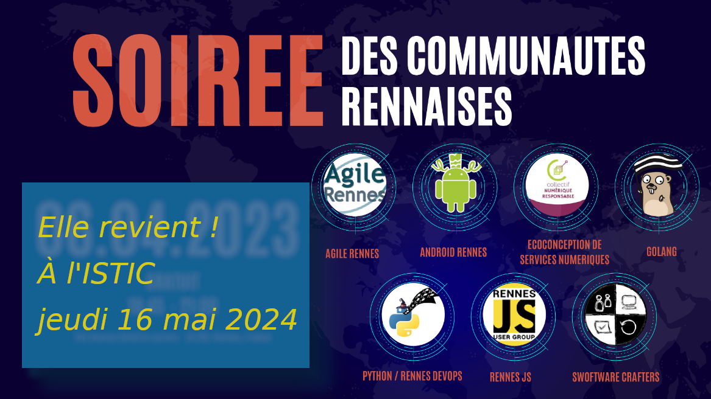

:revealjs_customtheme: assets/beige-stylesheet.css
:revealjs_progress: true
:revealjs_slideNumber: true
:source-highlighter: highlightjs
:icons: font
:toc:

= Python Rennes - jeudi 11 janvier 2024

== Type, Plugin et Match

image::assets/python-rennes-2024.01.11-type-plugin-match.webp[width="60%"]

[.medium-text]
--
- Introduction aux type hints (**Michel Caradec**)
- Implémenter un système de plugins en Python (**Florian Strzelecki**)
- Faites un bon match avec Python (**David Blanchet**)
--

[.small-text]
--
Python Rennes - jeudi 11 janvier 2024
--

=== Rediffusion des présentations

.Rediffusion vidéo : https://www.youtube.com/watch?v=qAS-zj0irEM
video::qAS-zj0irEM[youtube,width=480,height=360]

[.medium-text]
--
. Introduction aux type hints (Michel Caradec). Projet et présentation sur ce dépôt gitlab : https://gitlab.com/reech-oss/meetup/meetup-python-rennes-typing[reech-oss/meetup/meetup-python-rennes-typing]
. Implémenter un système de plugins en Python (Florian Strzelecki) : link:2024.01.11-python-rennes-architecture_plugins-Florian_Strzelecki.pdf[diaporama PDF]
. Faites un bon match avec Python (David Blanchet) : link:2024.01.11-python-rennes-Faites_un_bon_match_avec_Python.pdf[diaporama PDF], link:2024.01.11-python-rennes-Faites_un_bon_match_avec_Python-avec_notes_de_présentation.pdf[diaporama PDF avec notes de présentation]
--

[.columns]
== La communauté Python Rennes

[.column]
--
[.medium-text]
Un espace d'échanges "services numériques" qui complète les communautés Python existantes orientées IA.

.Groupe meetup : https://www.meetup.com/fr-FR/python-rennes/
image::assets/python_rennes-communauté.png[communauté Python Rennes]
--

[.column]
--
[.medium-text]
Rejoignez https://pythonrennes.slack.com[pythonrennes.slack.com] (actualités, entraide, orga).

[.medium-text]
📣 Suggestions et propositions d'interventions.

.Invitation slack : https://join.slack.com/t/pythonrennes/shared_invite/zt-1yd4yioap-lBAngm3Q0jxAKLP6fYJR8w

--

[.column]
--
[.medium-text]
Compte +++<del>+++Twitter+++</del>+++ **X** 🤷 : https://twitter.com/PythonRennes[@PythonRennes]
--

== Quoi de n'œuf ?

image::assets/reptile-python-hatching-egg-820x459.jpg[credits: Heiko Kiera - Shutterstock - https://www.aboutanimals.com/reptile/, width=50%]

Canal https://app.slack.com/client/T049W7K3GDA/C049TNM0G8K[#quoi-de-noeuf]

[.columns]
=== Frameworks graphiques pour data-apps

[.column]
--
[.medium-text]
Rediffusion **Interfaces graphiques web en Python - retours d'exp. NiceGUI, Gradio, Streamlit** (@bruno @gaël @fabien)

.chaîne YouTube du BreizhCamp : https://www.youtube.com/watch?v=yspHNEFjKfQ
video::yspHNEFjKfQ[youtube,width=480,height=260]
--

[.column]
--
https://solara.dev/[solara.dev] (@michel)

[.medium-text]
* ipywidgets
* API inspirée de React
--

[.column]
--
https://panel.holoviz.org/[panel.holoviz.org] (@gaël)

[.medium-text]
* compatible avec les bibliothèques de data-viz (vega, bokeh, seaborn, matplotlib, etc.)
* intégrable dans Jupyter
* serveur web Python (Tornado, FastAPI, Flask, Django)
* client Python natif (web-assembly) !
--

[.columns]
=== Python et intelligences artificielles (@luc)

[.column]
--

[.medium-text]
Meetup https://www.meetup.com/fr-FR/generative-ai-rennes/[Generative AI Rennes]

[.small-text]
* chaîne YouTube https://www.youtube.com/@GenerativeAIRennes[@GenerativeAIRennes]

--

[.column]
--
[.medium-text]
https://tryolabs.com/blog/top-python-libraries-2023[Top 10 des bibliothèques Python innovantes] de TryOLabs

[.small-text]
* LiteLLM (couche d'abstraction uniformisant l'utilisation de LLM)
* TaiPy (UI pour data-apps)
* MLX (ML pour Apple silicon)
* unstructured & WhisperX (prétraitement de textes)
* ZenML & AutoMLOps (pipelines ML)
* (audio -> texte avec horodatage)
* AutoGen (bots conversationnels), etc.

[.small-text]
Mais aussi : PyApp (déploiement), Temporian & functime (traitements d'horodatage), etc.
--

[.column]
--
[.medium-text]
Livre blanc https://dataforgood.fr/iagenerative/[Les grands défis de l’IA générative] de l'association Data for good

[.small-text]
. fiabilité de l'information
. propriété intellectuelle et données personnelles
. biais algorithmique
. **impact environnemental et sociétal**
. tech for good ?

[.small-text]
* webinaire https://www.youtube.com/watch?v=uf62I49mmok[Les grands défis de l'IA générative]
* podcast Techologie https://techologie.net/episodes/83-bombes-carbones-et-usages-de-la-data-et-de-l-ia/[Bombes carbones et usages de la data et de l'IA]
--

=== Développer

[.medium-text]
* vidéo d'Anthony Writes Codes https://www.youtube.com/watch?v=8nvfOjvOF5w[prefer tuples to lists!] (@michel)
* https://pythontutor.com/python-compiler.html (@michel)
** compilateur, exécuteur pas-à-pas de petits scripts Python
* analyse statique de code : https://devblogs.microsoft.com/python/python-linting-video/[lint dans codium / vsCode] (@michel)
* rediffusion des conférences #WhoRunTheTech (@luc)
**  https://www.youtube.com/playlist?list=PL4MHvaRnrWwEVqeo6Jeqt9_iLeP5thCWe
* podcast 🇬🇧 https://pypodcats.live/episodes/[PyPodcats] (@michel)
* https://www.da.vidbuchanan.co.uk/blog/python-swar.html[SIMD in Pure Python] : jeu de la vie de Conway & utilisation d'opérateurs binaires pour paralléliser les calculs @david

=== Infrastructure

* vulnérabilités dans les bibliothèques Python (@michel)
** https://osv.dev/list?ecosystem=PyPI
** https://thehackernews.com/2023/12/116-malware-packages-found-on-pypi.html[116 Malware Packages Found on PyPI Repository Infecting Windows and Linux Systems] (HackerNews)
* `magic-wormhole` : échanger des fichiers / secrets / clés SSH de façon sécurisée
** https://pypi.org/project/magic-wormhole/
** https://blog.stephane-robert.info/docs/securiser/secrets/wormhole/

=== Sorties

[.medium-text]
--
* répondez à l'enquête sur les pratiques de développement Python 2023 (Python Software Foundation & JetBrains) (@luc)
** https://survey.alchemer.com/s3/7554174/python-developers-survey-2023
* https://www.djangoproject.com/weblog/2023/dec/04/django-50-released/[Django 5.0] (@florian)
* https://www.python.org/downloads/release/python-3117/[Python 3.11.7] (@michel)
** tomllib : gestion native de fichiers .toml
** ajout d'opérateurs dans les reg-exp : groupement atomique `(?>...)`, quantifieurs possessifs `*+, ++, ?+, {m,n}+`
** suite du projet _faster CPython_
** groupe d'exceptions `*except`, groupe de tâches dans `asyncio`
* 1re maintenance de 3.12 : https://www.python.org/downloads/release/python-3121/[Python 3.12.1] (@michel)
* PR pour l'ajout d'un compilateur _just-in-time_ pour Python 3.13 : https://tonybaloney.github.io/posts/python-gets-a-jit.html[Python 3.13 get a JIT] (@jean-luc)
--

=== Soirée des communautés techniques rennaises 2024

