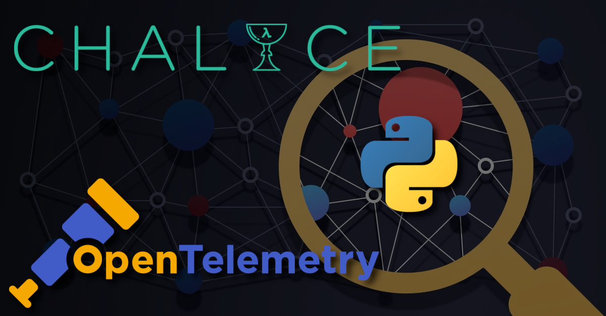

:revealjs_customtheme: assets/beige-stylesheet.css
:revealjs_progress: true
:revealjs_slideNumber: true
:source-highlighter: highlightjs
:icons: font
:toc:

= Python Rennes - 10 octobre 2024

== Serverless avec chalice, monitoring métier avec OpenTelemetry

[.medium-text]
--
* Construire une app python serverless avec chalice (**Martin Guillon Verne**)
* Instrumenter du code Python avec OpenTelemetry (**Frédéric Collonval**)
* Mettre en place un script Python afin d'exposer des metrics pour Node Exporter (**Christopher Louët**)
--

[.small-text]
Python Rennes - jeudi 10 octobre 2024

[.columns]
=== La communauté Python Rennes

[.column]
--
[.medium-text]
Communauté "services numériques" complétant les communautés datascience existantes.

[.medium-text]
388 membres 🎉

.Groupe meetup : https://www.meetup.com/fr-FR/python-rennes/
image::assets/python_rennes-communauté.png[communauté Python Rennes]
--

[.column]
--
[.medium-text]
Rejoignez https://pythonrennes.slack.com[pythonrennes.slack.com] (actualités, entraide, orga).

[.medium-text]
79 membres

.Invitation slack : https://join.slack.com/t/pythonrennes/shared_invite/zt-1yd4yioap-lBAngm3Q0jxAKLP6fYJR8w
image::assets/qr_code-slack-Python_Rennes.svg[Rejoindre le slack Python Rennes, 50%]
--

[.column]
--
[.medium-text]
Compte TwiXter : https://twitter.com/PythonRennes[@PythonRennes]

[.medium-text]
88 abonné·es
--

== Quoi de n'œuf ?

image::assets/reptile-python-hatching-egg-820x459.jpg[credits: Heiko Kiera - Shutterstock - https://www.aboutanimals.com/reptile/, width=50%]

Canal https://app.slack.com/client/T049W7K3GDA/C049TNM0G8K[#quoi-de-noeuf]

=== Sortie de Python 3.13 ! 🥳

* REPL : coloration, édition et rappel multilignes, `exit`
* mode expérimental sans _global interpreter lock_
* just-in-time compiler expérimental
* interpréteur plus rapide
* support des plateformes Android, iOS, WASI
* amélioration du système de typage
* externalisation de modules de la bibliothèque standard (notamment `lib2to3`)

[.small-text]
* https://www.python.org/downloads/release/python-3130/[www.python.org/downloads/release/python-3130]
* coups de 💙💛 d'https://www.youtube.com/@anthonywritescode[@anthonywritescode] : https://www.youtube.com/watch?v=gqqgwyNx52Q[www.youtube.com/watch?v=gqqgwyNx52Q]

=== Écosystème & pratiques

* sondage "pratiques de dev Python" PSF & JetBrains
** résultats 2023 : https://lp.jetbrains.com/fr-fr/python-developers-survey-2023/[lp.jetbrains.com/fr-fr/python-developers-survey-2023/]
** enquête 2024 : https://survey.alchemer.com/s3/8009809/python-developers-survey-2024[survey.alchemer.com/s3/8009809/python-developers-survey-2024]

=== 🤿

[.medium-text]
* inspecter vos objets : https://pypi.org/project/wat-inspector/[pypi.org/project/wat-inspector/]
* pré-processing Python via les codecs de décodage de fichiers : https://pydong.org/posts/PythonsPreprocessor/[pydong.org/posts/PythonsPreprocessor/]
* guide sur les fonctions internes de Python : https://www.mattlayman.com/blog/2024/www.mattlayman.com/blog/2024/layman-guide-python-built-in-functions/[www.mattlayman.com/blog/2024/www.mattlayman.com/blog/2024/layman-guide-python-built-in-functions/]
* fonctions méconnues de la bibliothèque standard: https://www.trickster.dev/post/lesser-known-parts-of-python-standard-library/[www.trickster.dev/post/lesser-known-parts-of-python-standard-library/]
* utiliser `python -m http.server` avec SSL : https://valarmorghulis.io/tech/202409-python-http-serveri-in-ssl/[valarmorghulis.io/tech/202409-python-http-serveri-in-ssl/]
* itertools expliqué par les 🍨 : https://www.reddit.com/r/Python/comments/1eaarah/itertools_combinatorial_iterators_explained_with/[www.reddit.com/r/Python/comments/1eaarah/itertools_combinatorial_iterators_explained_with/]
* écrire une extension Python en rust 🦀 : https://pythonspeed.com/articles/intro-rust-python-extensions/[pythonspeed.com/articles/intro-rust-python-extensions/]

=== 📦 packaging

[.medium-text]
* bonnes pratiques Docker pour Python : https://martynassubonis.substack.com/p/optimizing-docker-images-for-python[martynassubonis.substack.com/p/optimizing-docker-images-for-python]
* utiliser un venv dans un container Docker : https://hynek.me/articles/docker-virtualenv/[hynek.me/articles/docker-virtualenv/]
* PEP proposant un format standard de description de dépendances projet : https://peps.python.org/pep-0751/[peps.python.org/pep-0751/]
* histoire du packaging de projets pythons : https://www.bitecode.dev/p/whats-the-deal-with-setuptools-setuppy[www.bitecode.dev/p/whats-the-deal-with-setuptools-setuppy]
* dépendances et python avec `uv` : https://astral.sh/blog/uv-unified-python-packaging[astral.sh/blog/uv-unified-python-packaging]

=== Data 📊

[.medium-text]
* couche d'abstraction sur des bibliothèques de manipulation de données (DuckDB, Polars, Pandas) ou de stockage SQL (PostgreSQL, MySQL, etc.) : https://ibis-project.org/[ibis-project.org/]
* CLI pour SQLite : https://github.com/dbcli/litecli[github.com/dbcli/litecli]
* comparaison des API des dataframes de Polars et pandas : https://arilamstein.com/blog/2024/09/04/why-im-switching-to-polars/[arilamstein.com/blog/2024/09/04/why-im-switching-to-polars/]
* un module léger de dataviz dans Polars 🦀 : https://pola.rs/posts/lightweight_plotting/[pola.rs/posts/lightweight_plotting/]
* Python dans Excel : https://techcommunity.microsoft.com/t5/excel-blog/python-in-excel-available-now/ba-p/4240212[techcommunity.microsoft.com/t5/excel-blog/python-in-excel-available-now/ba-p/4240212]

=== Infra & architecture 🧱

[.medium-text]
* analyse et validation de dépendances (imports) entre modules :
** https://github.com/gauge-sh/tach[github.com/gauge-sh/tach] 🦀
** https://marketplace.visualstudio.com/items?itemName=Gauge.tach[marketplace.visualstudio.com/items?itemName=Gauge.tach]
* outillage cybersécurité
** https://github.com/Z4nzu/hackingtool[github.com/Z4nzu/hackingtool]
** https://exegol.readthedocs.io/en/latest/index.html[exegol.readthedocs.io/en/latest/index.html]
* monitoring et page de statut d'un service : https://github.com/harsxv/tinystatus[github.com/harsxv/tinystatus]
* authentification alternative à Keycloak, Auth0 : https://goauthentik.io/[goauthentik.io/]
* abstraction sur des stockages _objet_ type AWS S3, Azure Blob Storage ou encore GCP : https://pypi.org/project/cloudpathlib/[pypi.org/project/cloudpathlib/]
* un firewall applicatif embarqué écrit en Python : https://www.nolimitsecu.fr/renaud-bidou-pyrasp/[www.nolimitsecu.fr/renaud-bidou-pyrasp/]

=== Projets code 🧰

[.medium-text]
* Pre-commit
** sous le capot : https://stefaniemolin.com/articles/devx/pre-commit/behind-the-scenes/[stefaniemolin.com/articles/devx/pre-commit/behind-the-scenes/]
** écrire son hook : https://stefaniemolin.com/articles/devx/pre-commit/hook-creation-guide/[stefaniemolin.com/articles/devx/pre-commit/hook-creation-guide/]
** atelier : https://stefaniemolin.com/pre-commit-workshop[stefaniemolin.com/pre-commit-workshop]
** évoqué dans Real Python podcast : https://realpython.com/podcasts/rpp/220/[realpython.com/podcasts/rpp/220/]
* memoization sur disque avec https://joblib.readthedocs.io/en/latest/memory.html[joblib] : https://maxhalford.github.io/blog/python-daily-cache[maxhalford.github.io/blog/python-daily-cache]
* tracer de lambdas & compréhensions : https://www.devtoix.com/en/projects/pytracetoix[www.devtoix.com/en/projects/pytracetoix]

=== Projets web 🌐

[.medium-text]
* gestion des tests unitaires Django dans vsCode 1.93 : https://code.visualstudio.com/docs/python/testing#_django-unit-tests[code.visualstudio.com/docs/python/testing#_django-unit-tests]
* module natif et bibliothèques HTTP synchrones et asynchrones : https://www.speakeasy.com/post/python-http-clients-requests-vs-httpx-vs-aiohttp[www.speakeasy.com/post/python-http-clients-requests-vs-httpx-vs-aiohttp]
* curl vers Python
** https://curlconverter.com/python/[curlconverter.com/python/]
** https://marketplace.visualstudio.com/items?itemName=curlconverter.curlconverter[marketplace.visualstudio.com/items?itemName=curlconverter.curlconverter]
* REPL web Pyodide :
** 7 REPL en ligne : https://www.kdnuggets.com/7-free-online-python-repls[www.kdnuggets.com/7-free-online-python-repls]
** https://pyodide.org/en/stable/console.html[pyodide.org/en/stable/console.html]
** utiliser DuckDB dans le navigateur : https://duckdb.org/2024/10/02/pyodide.html[duckdb.org/2024/10/02/pyodide.html]

=== Tutos, vidéos & rediffusions 🍿

[.medium-text]
* BreizhCamp 2024 : https://www.youtube.com/playlist?list=PLv7xGPH0RMUSa01SXi__a8r2rvrVJbgaU[www.youtube.com/playlist?list=PLv7xGPH0RMUSa01SXi__a8r2rvrVJbgaU]
* PyConUS 2024 : https://www.youtube.com/playlist?list=PL2Uw4_HvXqvYhjub9bw4uDAmNtprgAvlJ[www.youtube.com/playlist?list=PL2Uw4_HvXqvYhjub9bw4uDAmNtprgAvlJ]
* 70 Leetcode problems in 5+ hours : https://youtu.be/lvO88XxNAzs[youtu.be/lvO88XxNAzs]
* outil capture et diffusion d'écran : https://github.com/henrywoo/kazam[github.com/henrywoo/kazam]
