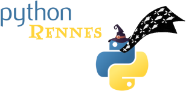

:revealjs_customtheme: assets/beige-stylesheet.css
:revealjs_progress: true
:revealjs_slideNumber: true
:source-highlighter: highlightjs
:icons: font
:toc:

= Python Rennes - mardi 22 avril 2025

== Documentation : trouver son style

image::assets/2025.04.22-python_documentation.png[width="60%"]

[.medium-text]
--
* Documentation : trouver son style (**Florian Strzelecki**)
--

[.small-text]
Python Rennes - mardi 22 avril 2025

== Prochainement dans http://rennes.tech

[.medium-text]
--
Jeudi 24 avril 2025

* *BreizhJUG* : Du JIT à l'AOT - Naviguer dans le Paysage des Applications Cloud-Ready (chez IDnow)
* *Rennes DevOps* : AWS Summit, KubeCon, Google Next'25 & Optimisation des Coûts AWS ! 🚀 (chez Zenika)

Mardi 17 juin 2025

* *Who run the tech?* (EstimNumérique) : ouverture du CFP (https://www.linkedin.com/posts/estimnumerique_whorunthetech-womenintech-rennes-activity-7320363256844357634-82ta[www.linkedin.com/posts/estimnumerique_whorunthetech-womenintech-rennes-activity-7320363256844357634-82ta])
--

[.columns]
=== La communauté Python Rennes

[.column]
--
[.medium-text]
Communauté "services numériques" complétant les communautés datascience existantes.

[.medium-text]
432 membres

.Groupe meetup : https://www.meetup.com/fr-FR/python-rennes/

--

[.column]
--
[.medium-text]
Rejoignez https://pythonrennes.slack.com[pythonrennes.slack.com] (actualités, entraide, orga).

[.medium-text]
93 membres

.Invitation slack : https://join.slack.com/t/pythonrennes/shared_invite/zt-1yd4yioap-lBAngm3Q0jxAKLP6fYJR8w
image::assets/qr_code-slack-Python_Rennes.svg[Rejoindre le slack Python Rennes, 50%]
--

[.column]
--
[.medium-text]
* BlueSky : https://bsky.app/profile/pythonrennes.bsky.social/[@pythonrennes.bsky.social] : 53 membres
* Mastodon : https://social.breizhcamp.org/@pythonrennes[@pythonrennes@social.breizhcamp.org] : 22 membres
* LinkedIn : https://www.linkedin.com/groups/13121746/[www.linkedin.com/groups/13121746] : 10 membres
--

== Quoi de n'œuf ?

image::assets/reptile-python-hatching-egg-820x459.jpg[credits: Heiko Kiera - Shutterstock - https://www.aboutanimals.com/reptile/, width=50%]

Canal https://app.slack.com/client/T049W7K3GDA/C049TNM0G8K[#quoi-de-noeuf]

=== Écosystème Python

[.medium-text]
*  https://www.pycon.fr/2025/[www.pycon.fr/2025] à Lyon
** 2 jours d'atelier de développement participatif les 30 et 31 octobre
** 2 jours de conférences les 1er et 2 novembre
* ouverture de la billetterie pour EuroPython (Prague, 14-20 juillet) : https://ep2025.europython.eu/tickets/[ep2025.europython.eu/tickets]
* arrivée des template-strings dans Python 3.14 : https://peps.python.org/pep-0750[peps.python.org/pep-0750]
* format de lockfile des dépendances : https://peps.python.org/pep-0751/[peps.python.org/pep-0751]
* podcast parlant occasionnellement de Python : https://podcast.ausha.co/tranches-de-tech/python-a-la-folie[podcast.ausha.co/tranches-de-tech/python-a-la-folie]
* benchmark Python 3.14 : https://simonwillison.net/2025/Feb/13/python-3140a5/[simonwillison.net/2025/Feb/13/python-3140a5]

=== Bibliothèques

[.medium-text]
* mocker une API tierce dans des tests d'intégration : https://github.com/amaziahub/mimicker[github.com/amaziahub/mimicker]
* Pydantic 2.11, gains de performance et consommation mémoire : https://pydantic.dev/articles/pydantic-v2-11-release[pydantic.dev/articles/pydantic-v2-11-release]
* débugger un parsing de JSON : https://github.com/a2intl/pos-json-decoder[github.com/a2intl/pos-json-decoder]

=== Services et outils

[.medium-text]
* analyse des données des montres Garmin : https://github.com/tcgoetz/GarminDB[github.com/tcgoetz/GarminDB]
* automatiser la collecte de captures d'écran de pages web : https://github.com/goodreasonai/ScrapeServ[github.com/goodreasonai/ScrapeServ]
* générer le code de production par l'IA en fonction des TU écrits : https://claudio.uk/posts/unvibe.html[claudio.uk/posts/unvibe.html]
* projet de prises de notes collaboratives proposé par les gouvernements français et allemand : https://github.com/suitenumerique/docs[github.com/suitenumerique/docs]
* utilisation de Python free-threaded dans les Github actions : https://hugovk.dev/blog/2025/free-threaded-python-on-github-actions/[hugovk.dev/blog/2025/free-threaded-python-on-github-actions]
* shells augmentés en Python : https://xon.sh/[xon.sh], https://www.marceltheshell.org/[www.marceltheshell.org]
* initialisation de projet Python
** par des modèle à forker : https://github.com/neubig/starter-repo[github.com/neubig/starter-repo]
** par des CLI et des templates : https://pyscaffold.org/en/stable/[pyscaffold.org], https://copier.readthedocs.io/[copier.readthedocs.io]

=== Code

[.medium-text]
* mécanique interne : de FastAPI : https://rafiqul.dev/blog/fastapi-deconstructed-anatomy-of-modern-asgi-framework[rafiqul.dev/blog/fastapi-deconstructed-anatomy-of-modern-asgi-framework]
* jargon Python : https://www.pythonmorsels.com/terms/[www.pythonmorsels.com/terms]
* uv-based project layout : https://www.youtube.com/watch?v=mFyE9xgeKcA[www.youtube.com/watch?v=mFyE9xgeKcA]
* documentation dédiée aux annotations de typage : https://typing.python.org/en/latest/[typing.python.org/en/latest/]
* découvrir l'outillage de l'écosystème Python : https://pydevtools.com/handbook/[pydevtools.com/handbook/]
* retour d'expérience sur uv après un an d'utilisation dans différents contextes : https://www.bitecode.dev/p/a-year-of-uv-pros-cons-and-should[www.bitecode.dev/p/a-year-of-uv-pros-cons-and-should]
* tutoriel générateurs et `yield` : https://pybit.es/articles/generator-mechanics-expressions-and-efficiency/[pybit.es/articles/generator-mechanics-expressions-and-efficiency/]
* tutoriel illustré d'exemples sur les concepts de qualité de code : https://realpython.com/python-code-quality/[realpython.com/python-code-quality]

=== Cybersécurité

[.medium-text]
* attaque via des notebooks partagés : https://gbhackers.com/hackers-exploiting-exposed-jupyter-notebooks/[gbhackers.com/hackers-exploiting-exposed-jupyter-notebooks]
* attaque par la chaîne de dépendances via les moyens de paiement : https://www.bleepingcomputer.com/news/security/carding-tool-abusing-woocommerce-api-downloaded-34k-times-on-pypi/[www.bleepingcomputer.com/news/security/carding-tool-abusing-woocommerce-api-downloaded-34k-times-on-pypi/]

=== Data

[.medium-text]
* dataviz avec seaborn (surcouche à matplotlib) : https://seaborn.pydata.org/[seaborn.pydata.org]
* manipulation de données avec Ibis : https://blog.structuredlabs.com/p/a-technical-intro-to-ibis-the-portable[blog.structuredlabs.com/p/a-technical-intro-to-ibis-the-portable]