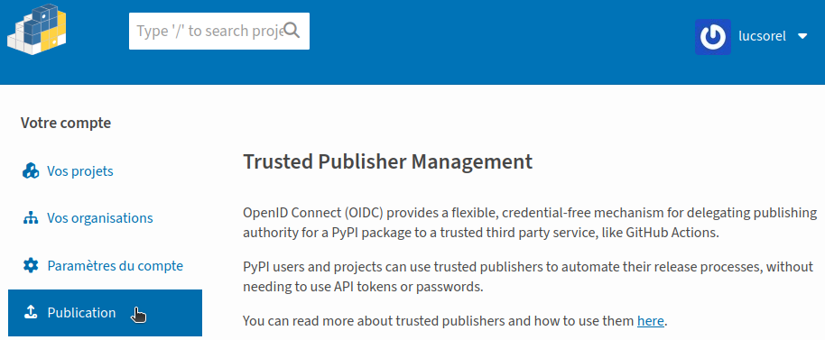

:revealjs_customtheme: assets/beige-stylesheet.css
:revealjs_progress: true
:revealjs_slideNumber: true
:source-highlighter: highlightjs
:icons: font
:toc:

= Python Rennes - mardi 17 mars 2026

== Automatiser une release avec Github actions : montée de version, publication sur PyPI

.Rediffusion vidéo : https://www.youtube.com/watch?v=KKBBOGeRPJg&t=578 (merci Alex pour la captation !)
image::assets/2026.03.17-ci-cd-projets-python-2.jpg[width="50%",link="https://www.youtube.com/watch?v=KKBBOGeRPJg&list=PLv7xGPH0RMUT1GSCGHJmqnswpk-nyz5aq&t=578"]

[.small-text]
Python Rennes - mardi 17 mars 2026 - Kanoma

== Qui suis-je ?

* 💙💛 lead dev Python / Vuejs @ https://www.seeyousun.fr/[SeeYouSun] 🌞⚡
* 🐈‍⬛ https://github.com/lucsorel[github.com/lucsorel] (outils code-to-doc)
* 🐘 https://floss.social/@lucsorelgiffo[@lucsorelgiffo@floss.social]

== Publication de paquet sur PyPI

.Le dépôt communautaire de paquets Python
image::assets/pypi-logo.svg[width="20%"]

[.medium-text]
* 765 531 projets (mars 2026)
* 8 262 044 versions
* ~5 milliards de téléchargements / jour
* dashboard public d'infrastructure : https://p.datadoghq.com/sb/7dc8b3250-85dcf667bd

=== Souviens-toi... l'été dernier 😱

.Retours d'expérience - intégration continue et déploiement de projets Python : https://www.youtube.com/watch?v=JdHFz67l-Ms (12 octobre 2023)


[.medium-text]
Hooks de pre-commit + workflow CI de qualité de code :

[.medium-text]
* conventional commits
* formatage et analyse statique de code
* tests automatisés

=== 🧗 Un cliffhanger de 3 ans !

[plantuml, target=sequence-diagram, format=svg]
----
@startuml ci-semantic-release-publish
!option handwritten true

participant "branche de dev" as feature
feature -> feature : workflow de build
note right
  vulnérabilités des dépendances (""pip-audit"")

  ""pre-commit"" :
  - format de message de commit (**commitlint**)
    (refactor, fix, feat, etc.)
  - formatage, lint, etc.

  tests automatisés
end note

feature -> main : fusion PR
main -> main : workflow de release
note right
  montée de version (**python-semantic-release**)
  - messages de commits -> nouvelle version ""$NEW_VERSION = maj.min.patch""
  - màj ""pyproject.toml"", ""~__version~__.py"", etc.
  - ""git commit -m "[skip ci] $NEW_VERSION""" (évite de boucler sur le workflow)
  - poussée du nouveau tag (ça n'est pas un commit)

  publication
  - ""poetry ~--build publish ~--repository ...""
    (le numéro de version dans pyproject.toml est utilisé pour le numéro de version)
end note

main -> PyPI : publication ""$NEW_VERSION""
@enduml
----

=== Dénouement

* il n'est plus possible de pousser un artefact sur PyPI depuis son poste avec ses credentials
* la majorité des corruptions de paquets ont été faites via des credentials volés
* encouragement du mécanisme "trusted publishing"

Sources :

* https://bernat.tech/posts/securing-python-supply-chain/
* https://blog.pypi.org/tags/#tag:security

== Trusted publishing : publication de confiance

[.medium-text]
--
* délégation de la publication à un processus de CI/CD
** Github
** Gitlab
** ActiveState
** Google
* tokens à courte durée de vie
* protocole OpenID Connect (OIDC), basé sur oAuth2.0

Sources :

* https://docs.pypi.org/trusted-publishers/
* https://openid.net/developers/how-connect-works/
--

=== Trusted publishing : mécanisme général

[plantuml, target=sequence-diagram, format=svg]
----
@startuml trusted-publishing
participant "GitHub actions" as GH
participant "PyPI" as PyPI

note over PyPI
  connexion 2FA
end note
group Déclaration d'une source de confiance
PyPI -> PyPI :- nom du package PyPI\n- dépôt GitHub\n- nom du fichier de workflow (ex : release.yml)\n- environnement du workflow (ex : pypi)
end
group workflow de publication : release.yml
  ?-> GH ++: commit sur main (PR)
  GH -> GH
  note left: job de packaging
  GH -> PyPI ++: envoi de token OIDC
  note left: job de publication
  PyPI -> GH --: token éphémère de publication
  deactivate PyPI
  GH -> PyPI ++: envoi des artefacts
  PyPI -> GH --: aquittement
  deactivate GH
end
@enduml
----

[.columns]
=== Déclarer une source de publication de confiance

[.column]
--


[.medium-text]
Mène à https://pypi.org/manage/account/publishing/[pypi.org/manage/account/publishing/]
--

[.column]
--

[plantuml, target=sequence-diagram, format=svg]
----
@startsalt
{
  **PyPI Nom du projet** (obligatoire)
  "my-package  "
  .
  .
  **Propriétaire** (obligatoire)
  "user_ou_orga "
  .
  **Nom du dépôt** (obligatoire)
  "my-package  "
  .
  **Nom du flux de travail** (obligatoire)
  "release.yml "
  .
  **Nom de l'environnement** (facultatif)
  "pypi        "
  .
  [Ajouter]
}
@endsalt
----

[.small-text]
* dépot : `github.com/{user_ou_org}/{my-package}`
* workflow : `.github/workflows/release.yml`

[.medium-text]
(voir la https://docs.github.com/en/actions/how-tos/deploy/configure-and-manage-deployments/manage-environments[documentation sur les environnements GitHub])
--

=== Workflows de publication 🏊

[.medium-text]
--
Plein de déclencheurs possibles (voir https://docs.github.com/en/actions/writing-workflows/choosing-when-your-workflow-runs/events-that-trigger-workflows[docs.github.com/.../events-that-trigger-workflows]) :

* à la pose d'un tag de release (voir https://github.com/michelcaradec/horsebox/blob/main/.github/workflows/python-publish.yml[michelcaradec/horsebox])
--

[,yaml]
----
on:
  release:
    types: [published]
----

[.medium-text]
* à la fusion d'une PR sur main

[,yaml]
----
on:
  pull_request:
    branches: [ "main" ]
----

[.medium-text]
* au commit sur main

[,yaml]
----
on:
  push:
    branches: [ "main" ]
----

=== Packager et pousser les artefacts 🏊🏊

[.medium-text]
--
* avec build et twine, flit (https://realpython.com/pypi-publish-python-package/[realpython.com/pypi-publish-python-package])
* uv build, uv publish (https://docs.astral.sh/uv/guides/package/[docs.astral.sh/uv/guides/package])
* poetry build, poetry publish (https://python-poetry.org/docs/libraries#publishing-to-pypi[python-poetry.org/docs/libraries#publishing-to-pypi])
* GitHub action https://github.com/pypa/gh-action-pypi-publish[pypa/gh-action-pypi-publish@release/v1]
* tutoriel https://realpython.com/pypi-publish-python-package/[realpython.com/pypi-publish-python-package]
* voir aussi https://packaging.python.org/en/latest/guides/publishing-package-distribution-releases-using-github-actions-ci-cd-workflows/[packaging.python.org/.../publishing-package-distribution-releases-using-github-actions-ci-cd-workflows]
--

=== 🤔 Mais en fait... 🏊🏊🏊

Qui dit publication, dit versionnement !

* semantic versioning (https://semver.org/[semver.org]) : majeur.mineur.patch
* calendar versioning (https://calver.org/[calver.org]) : YY.MM, YY.MM.DD, YY.mineur.micro

== Versionnement automatisé avec python-semantic-release (PSR)

Projet : https://python-semantic-release.readthedocs.io/en/latest/[python-semantic-release.readthedocs.io]

[.medium-text]
* calcul du prochain numéro de version via les messages de commits
* génération (initiale / incrémentale) d'un changelog
* insertion de la version dans la base de code (`pyproject.toml`, `+__init__:__version__+`, etc.)
* pose d'un tag de version
* packaging du projet
* publication (modifs, tags, artefacts) sur le repo

=== Proposition d'une configuration de CI/CD

* `code-quality.yml` : analyse statique de code, tests automatisés
* `release.yml` : sur `main`, quand `code-quality.yml` se passe bien
** calcul du numéro de version
** si nouvelle version :
*** modifications du projet (tag, changelog.md, pyproject.toml, uv.lock)
*** publication sur le repo des modifications
*** publication sur PyPI

=== Mise en oeuvre sur un projet utilisant uv

[,sh]
----
uv add --group package python-semantic-release
----

[,toml]
----
[dependency-groups]
dev = [
  ...
]
# pour les hooks de pre-commit
lint = ["pre-commit>=4.5.1"]
# pour le packaging
package = [
  "python-semantic-release>=10.5.3",
]

# les dépendances du groupe "package" ne seront pas installées par défaut
[tool.uv]
default-groups = ["dev", "lint"]
----

=== Configuration de PSR

[,sh]
----
# installation locale de python-semantic-release
uv sync --group package
# initialisation d'un fichier de configuration
uv run semantic-release generate-config > releaserc.toml
----

[.medium-text]
* semantic_release
** version_toml : localisation de la version du paquet dans `pyproject.toml`
** version_variables : localisations dans le code source
** tag_format : "v{version}" -> "{version}"
* semantic_release.branches.main
** match : branches impliquant une montée de version
* semantic_release.changelog
** mode : "init" / "update"
* semantic_release.commit_parser_options : conventional commits

=== Estimer le prochain numéro de version en local

[,toml]
----
[semantic_release.branches.main]
# activer temporairement la branche git courante
match = "(main|ma-branche)"
----

[,sh]
----
uv run semantic-release -c releaserc.toml -vv --noop version --print
----

=== Introduction aux conventional commits

[.medium-text]
Formalisme des messages de commit : https://www.conventionalcommits.org/en/v1.0.0/

[.medium-text]
Format de la 1re ligne ("l'entête") :

```markdown
<type>(<scope>)!: <short summary>
 │      │      │   └─ *résumé* au présent, sans majuscule initiale, ni point final
 │      │      │
 │      │      └─ (facultatif) "!" force l'incrément du n° de version majeur
 │      │
 │      └─ (facultatif) *contexte métier* concerné par le commit : le·s nom·s du
 │          module Python, du package concerné, ou périmètre fonctionnel
 │
 └─ *type* du commit : build|ci|chore|docs|feat|fix|perf|refactor|style|test
```

[.medium-text]
--
Articulation avec le versionnement sémantique :

* `"...!:"` : incrément majeur
* `feat` : incrément mineur
* `fix`, `perf` : incrément patch
* autres types : modifications non fonctionnelles -> pas d'incrément
--

=== Workflow release.yml - points d'attention 1/4

[.medium-text]
--
En détails : https://github.com/lucsorel/py2puml/blob/main/.github/workflows/release.yml[github.com/lucsorel/py2puml/blob/main/.github/workflows/release.yml]

👀 "on" : `release` déclenchée après un workflow `code-quality` sur `main`

[,yaml]
----
name: release

on:
  workflow_run:
    branches: [main]
    workflows: ["code-quality"]
    types:
      - completed
----

👀 attention aux permissions read / write des différents jobs

[,yaml]
----
# lecture seule par défault
permissions:
  contents: read
# ...
jobs:
  release:
    # ... écriture dans le repo quand nécessaire
    permissions:
      contents: write
    steps:
      # ...
      - id: release
        env:
          GH_TOKEN: ${{ secrets.GITHUB_TOKEN }}
        run: |
          # ...
          uv run semantic-release -c releaserc.toml publish
----
--

=== Points d'attention 2/4

[.medium-text]
👀 forcer le checkout du code au commit et sur la branche qui a lancé le workflow

[,yaml]
----
jobs:
  package:
    # ...
    steps:
      - uses: actions/checkout@v5
        with:
          fetch-depth: 0
          ref: ${{ github.sha }}

      - run: git checkout -B ${{ github.ref_name }}
----

=== Points d'attention 3/4

[.medium-text]
--
👀 articulation conditionnelle des jobs :

* une étape de job peut écrire une valeur de sortie dans `$GITHUB_OUTPUT`
* un job peut exporter des valeurs dans `outputs`
* l'exécution d'un job peut être conditionnée

[,yaml]
----
jobs:
  package:
    steps:
      - id: version
        # c'est semantic-release qui exporte des valeurs associées à l'étape "version"
        run: uv run semantic-release -c releaserc.toml -v version --skip-build --no-commit --no-tag --no-changelog

    # sorties associées au job "package"
    outputs:
      new-release-detected: ${{ steps.version.outputs.released }}
      # ...

  release:
    needs:
      - package
    if: ${{ needs.package.outputs.new-release-detected == 'true' }}
----

(voir https://docs.github.com/en/actions/how-tos/write-workflows/choose-what-workflows-do/pass-job-outputs[docs.github.com/en/actions/how-tos/write-workflows/choose-what-workflows-do/pass-job-outputs])
--

=== Points d'attention 4/4

[.medium-text]
--
👀 sécurisation et configuration de la publication sur PyPI :

[,yaml]
----
jobs:
  deploy:
    if: ${{ needs.release.outputs.released == 'true' && github.repository == 'lucsorel/py2puml' }}
    needs:
      - release

    environment:
      name: pypi
      url: https://pypi.org/project/py2puml/

    permissions:
      contents: read
      id-token: write

    steps:
      # gère la demande de token éphémère et la publication de confiance sur PyPI
      - uses: pypa/gh-action-pypi-publish@release/v1
        with:
          packages-dir: dist
          print-hash: true
          verbose: true
----
--

== Retours d'expérience

* le workflow de release 🥵 :
** une architecture en soi·e 🤭
** décisions d'articulation des outils
** le tester sur https://test.pypi.org[test.pypi.org]
* responsabilité des commits (contenu, message)
** type -> version
** message -> changelog
** (se) former aux https://www.conventionalcommits.org/en/v1.0.0/[www.conventionalcommits.org]

=== Garde-fous pour les commits

* `.pre-commit-config.yaml`

[,yaml]
----
- repo: https://github.com/alessandrojcm/commitlint-pre-commit-hook
  rev: v9.24.0
  hooks:
  - id: commitlint
    stages: [commit-msg]
    additional_dependencies: ['@commitlint/config-conventional']
----

* `commitlint.config.js`

[,js]
----
module.exports = {
    extends: [
        '@commitlint/config-conventional'
    ],
    rules: {
        // commit message 1st line and body of 150 characters max
        'header-max-length': [2, 'always', 150],
        'body-max-line-length': [2, 'always', 150],
    }
}
----

=== Accompagner la saisie des messages de commit

Extension codium / vsCode https://open-vsx.org/extension/redjue/git-commit-plugin[git-commit-plugin]

`.vscode/settings.json`

[,json]
----
{
  "GitCommitPlugin.MaxSubjectCharacters": 150,
  "GitCommitPlugin.ShowEmoji": false
}
----

=== Git power

[.medium-text]
Privilégier des pratiques git produisant un historique linéaire de commits pour faciliter le calcul de numéros de version.

[,sh]
----
# remanier l'historique des commits
git rebase -i {commit-hash}

# comportement au rebasage pour un historique linéaire
git config pull.rebase true
----

[.medium-text]
* préférer les rebasages de feature branches plutôt que des merges de la branche principale
* projet perso seulement pour l'instant
* accompagner l'équipe dans ses pratiques git

== Merci ! 🙏

Des questions ?

[.small-text]
Diaporama à retrouver sur https://github.com/lucsorel/conferences/tree/main/python-rennes-2026.03.17-ci-cd-projets-python-2[github.com/lucsorel/conferences/tree/main/python-rennes-2026.03.17-ci-cd-projets-python-2]
