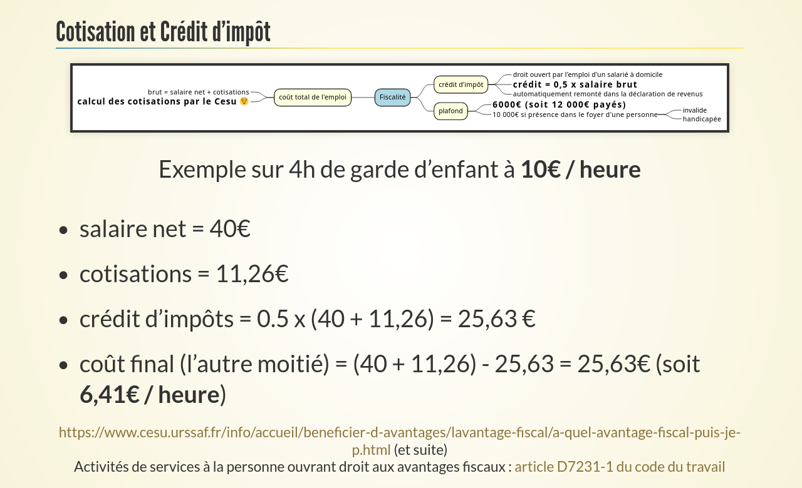

= Le Chèque Emploi Service Universel, Cesuper bien !

Présentation et retour d'expérience du 14 mars 2023 chez Zenika Rennes sur le Chèque Emploi Service Universel, un dispositif de l'Urssaf permettant de salarier une personne proposant tous types d'aide à la personne (garderie, soutien scolaire, jardinage et bricolage, aide à domicile, etc.). En fin de présentation, j'évoque les titres Cesu préfinancés qui permettent à un organisme financeur (votre entreprise ou CE, par exemple) de vous verser des titres Cesu pour financer vos aides à la personne.

* un export en pdf du diaporama : link:2023.03.14-Le_Chèque_Emploi_Service_Universel-Luc_Sorel-Giffo.pdf[2023.03.14-Le_Chèque_Emploi_Service_Universel-Luc_Sorel-Giffo.pdf]
* un https://youtu.be/qXN4DdRhFzQ[enregistrement vidéo de la présentation]

== Visionner le diaporama

La présentation a été écrite pour être visualisée à travers l'extension https://marketplace.visualstudio.com/items?itemName=flobilosaurus.vscode-asciidoc-slides[flobilosaurus.vscode-asciidoc-slides] pour Codium / vsCode.

. affichez la palette de commandes avec `ctrl shift p`
. utilisez la commande `Asciidoc Slides: Open Slides in Browser`

Documentation de la https://docs.asciidoctor.org/reveal.js-converter/latest/converter/features/[syntaxe asciidoc pour les présentations].

== Générer un pdf

. utilisez la commande `Asciidoc Slides: Export document as PDF` (ne fonctionne pas toujours)

ou :

. ouvrir la présentation dans le navigateur chromium / chrome
. rajouter `?print-pdf` à la fin de l'URL
. lancer l'impression en pdf avec `ctrl p` ou `cmd p`
