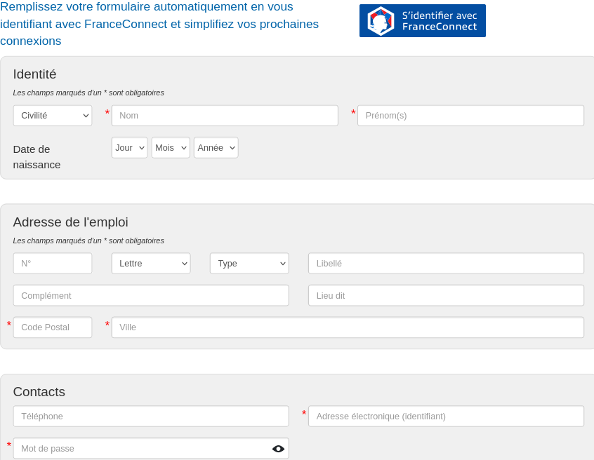
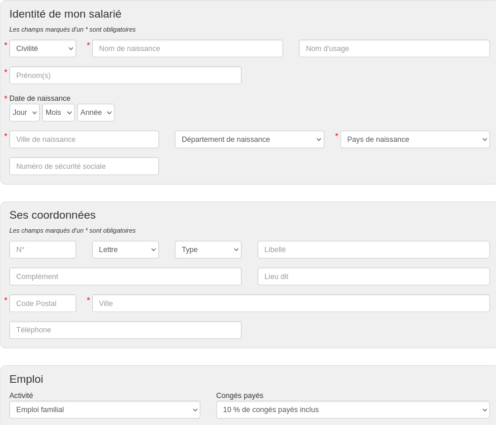
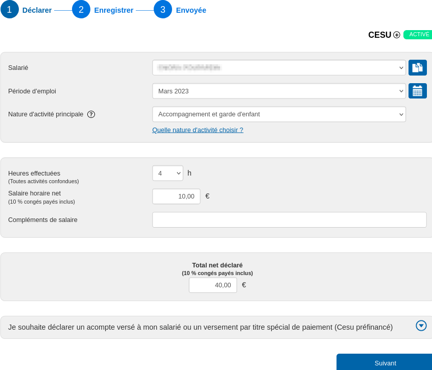
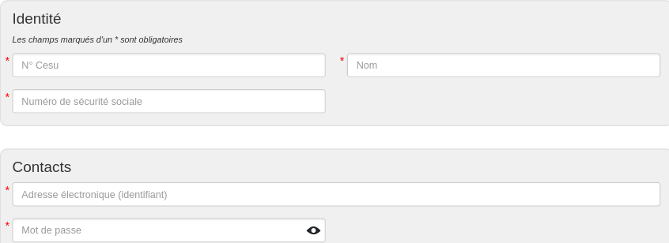

:revealjs_customtheme: assets/cesu-per-bien.css
:revealjs_progress: true
:revealjs_slideNumber: true
:source-highlighter: highlightjs
:icons: font
:toc:

= Le Chèque Emploi Service Universel, Cesuper bien !

== Le Cesu, pour soi et en entreprise 

.Source : https://www.cesu.urssaf.fr/info/accueil.html

Deux motivations pour cette intervention :

. REX personnel sur le CESU
. exploration de la piste des _Titres spéciaux de paiement_ (ex-_Titres Cesu préfinancé_) par l'employeur

[.small]
*Luc Sorel-Giffo* -- mardi 14 mars 2023 -- Zenika Rennes

=== Qu'est-ce que le Cesu ?

[plantuml, target=mindmap-diagram, format=svg]
----
@startmindmap
+[#lightblue] le Cesu ?
--[#lightyellow]  un service de l'URSSAF
---_ salarié à domicile
---_ services à la personne
---_ démarche facilitée
---_ crédit d'impôt
++[#lightyellow]  garanties
+++_ employeur (vous !) : légalité
+++_ employé (3ce personne) : couverture sociale
++++_ assurance maladie
++++_ chômage
++++_ congés payés
++++_ retraite
++[#lightyellow]  déclaratif
+++_ usage ponctuel ou régulier
+++_ pour un emploi à temps partiel ou complet
@endmindmap
----

=== Utilités 1/2

[plantuml, target=mindmap-diagram, format=svg]
----
@startmindmap
+[#lightblue] Quels services à la personne ?
--[#lightyellow] pour vous
---_ musique, peinture, etc.
---_ entretien de la maison
----_ ménage
----_ jardin
----_ bricolage
++[#lightyellow] pour vos enfants
+++_ soutien scolaire
+++_ garderie
@endmindmap
----

=== Utilités 2/2

[plantuml, target=mindmap-diagram, format=svg]
----
@startmindmap
+[#lightblue] Quels services ?
--[#lightyellow] pour vous
---_ musique, peinture, etc.
---_ maison
----_ ménage
----_ jardin
----_ bricolage
++[#lightyellow] pour vos enfants
+++_ soutien scolaire
+++_ garderie
++[#yellow] ♀️
+++_ majoritaires dans les métiers d'aide à la personne
+++_ baby-sitting
++++_ reconnaissance pro
+++++_ souvent le 1er métier des étudiantes
++++_ estime de soi
+++++_ ⚠️ mauvaise habitude d'accepter un salaire illégal
@endmindmap
----

== Comment utiliser le Cesu ?

. créer un compte employeur (c'est vous)
. faire une 1re déclaration
. automatiser les paiements et le crédit d'impôt avec le *Cesu +*

=== Créer un compte employeur

.Source : https://www.cesu.urssaf.fr/decla/index.html?page=page_adhesion_futur_employeur&LANG=FR

[.notes]
--
* formulaire ou FranceConnect (avec les Améli ou les impôts, par exemple)
* localité de l'emploi : la personne employée vient à domicile
--

=== Déclarer une nouvelle personne salariée

.Source : https://www.cesu.urssaf.fr/decla/index.html?page=page_empl_creation_salarie&LANG=FR

[.notes]
--
* gestion spécifique des CP possible seulement pour > 32 h de travail par mois
--

=== Faire une 1re déclaration de paiement

* la 1re déclaration affecte un numéro Cesu à la personne salariée

=== La personne salariée crée son compte

.Source : https://www.cesu.urssaf.fr/decla/index.html?page=page_adhesion_salarie&LANG=FR

=== Le *Cesu +* -- option _Avance Immédiate_

[plantuml, target=mindmap-diagram, format=svg]
----
@startmindmap
+[#lightblue] Le Cesu +
--[#lightyellow] automatise les flux
---_ salaires, cotisation
---_ déclenché par la déclaration en fin de mois
++[#lightyellow] pré-requis
+++_ un 1er paiement classique
+++_ souhait commun d'utiliser le Cesu +
+++_ renseigner ses coordonnées bancaires
++[#lightyellow] option Avance Immédiate
+++_ crédit d'impôt immédiatement déduit
+++_ suivi du crédit d'impôt
@endmindmap
----

=== Cotisation et Crédit d'impôt

[plantuml, target=mindmap-diagram, format=svg]
----
@startmindmap
+[#lightblue] Fiscalité
--[#lightyellow] coût total de l'emploi
---_ brut = salaire net + cotisations
---_ =calcul des cotisations par le Cesu 😌
++[#lightyellow] crédit d'impôt
+++_ droit ouvert par l'emploi d'un salarié à domicile
+++_ = crédit = 0,5 x salaire brut
+++_ automatiquement remonté dans la déclaration de revenus
++[#lightyellow] plafond
+++_ = 6000€ (soit 12 000€ payés)
+++_ 10 000€ si présence dans le foyer d'une personne
++++_ invalide
++++_ handicapée
@endmindmap
----

Exemple sur 4h de garde d'enfant à *10€ / heure*

[%step]
* salaire net = 40€
* cotisations = 11,26€
* crédit d'impôts = 0.5 x (40 + 11,26) = 25,63 €
* coût final (l'autre moitié) = (40 + 11,26) - 25,63 = 25,63€ (soit *6,41€ / heure*)

[.small]
https://www.cesu.urssaf.fr/info/accueil/beneficier-d-avantages/lavantage-fiscal/a-quel-avantage-fiscal-puis-je-p.html (et suite)

[.small]
Activités de services à la personne ouvrant droit aux avantages fiscaux : https://www.legifrance.gouv.fr/codes/article_lc/LEGIARTI000033747429/[article D7231-1 du code du travail]

== Le Cesu préfinancé (_Titres spéciaux de paiement_)

.Source : https://www.cesu.urssaf.fr/info/accueil/lexique.html?letter=C#cesu-prefinance, https://www.youtube.com/watch?v=fCFkF9Yat50
[plantuml, target=use-case-diagram, format=svg]
----
@startuml
skinparam actorStyle awesome
:Organisme financeur\n(Zenika, CE, etc.): as Employeur
:Employé Zenika\n(employeur via le Cesu): as Employé
:Salarié (Cesu): as Salarié
package CRCESU
package "Espace employeur Cesu"

Employeur -> Employé : rémunère avec des Titres spéciaux Cesu
Employé --> Salarié : salarie avec les Titres spéciaux Cesu
Employé -> "Espace employeur Cesu" : déclaration des titres utilisés
Salarié -> CRCESU : échange les Titres spéciaux\ncontre des €
"Espace employeur Cesu" --> Salarié : génération des fiches de paie
@enduml
----

=== Règles du jeu

* l'employé·e donne son accord pour être rémunéré avec du Cesu préfinancé
* l'organisme financeur peut flécher les services éligibles à l'utilisation de ses titres (soutien scolaire, garde d’enfants, etc.)
* ⚠️ les titres sont millésimés
** non remboursables si non utilisés
** utilisable jusqu'au 31 janvier de l'année N+1
** échangeable contre des titres N+1 jusqu'au 28 février N+1
** le salarié Cesu a jusqu'à février N+1 pour les échanger contre des €

== En conclusion

Le Cesu, c'est :

* souple et pratique (on parle d'un service de l'Urssaf)
* utile : diversité d'aides à la personne
* éthique : responsabilisation employeur & salarié
* fiscalement intéressant : crédit d'impôt

=== Merci !

== Questions - réponses

=== Faut-il intégrer un contrat de travail dans le Cesu ?

Ça n'est pas nécessaire, le contrat de travail oral vaut contrat de travail écrit.

Le particulier employeur et le salarié déclaré auprès du Cesu peuvent convenir d'un contrat de travail oral, dans le respect des conditions prévues par le Droit du travail et la https://www.legifrance.gouv.fr/conv_coll/id/KALICONT000044594539[Convention collective de la branche du secteur des particuliers employeurs].

[.small]
https://www.cesu.urssaf.fr/info/accueil/gerer-la-relation-de-travail/contrat-de-travail/contrat-travail-obligatoire.html
